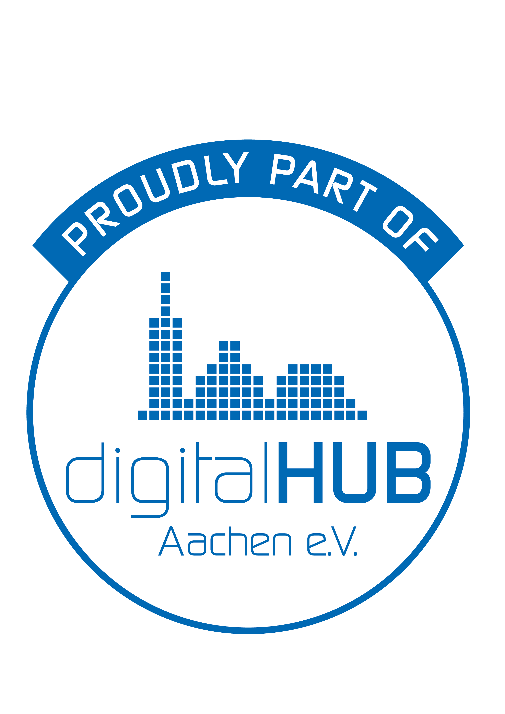

# EdgeFlow
**Route coverage planning for road-based inspections & fleets.**  
We help teams plan routes that **guarantee coverage of selected road segments** — efficiently.

> 🚧 **This site is a placeholder.** We’re currently building the MVP.  
> Want early access or a quick demo? Reach out below.

---

## What EdgeFlow does
EdgeFlow generates routes where you can define:

- **Start & end point**
- **Road segments that must be driven** (e.g., specific streets, lanes, inspection segments)
- Optional constraints like time limits, vehicle type, or priority segments

Then EdgeFlow outputs an optimized route that aims to:
- **Cover all required segments** (coverage guaranteed)
- **Minimize detours and total driving time**
- Keep the route **practical for real-world execution**

This is especially useful when “normal navigation” fails because you’re not trying to go from A→B — you’re trying to **cover a set of edges in a network**.

---

## Who it’s for (examples)
- **Waste Logistics**
- **Road condition inspection**
- **Infrastructure & facility operators** (airports, industrial sites, large campuses)
- **Utilities** (inspection of networks, patrol routes)
- **Mapping / surveying operations**
- **Any fleet task requiring segment coverage** (not just point-to-point)

---

## Why it matters
Most routing tools optimize **point visits** (stops).  
EdgeFlow optimizes **segment coverage** (roads/paths), similar to postman-style routing problems.

**Result:** less manual planning, less wasted driving, and consistent coverage.

---

## Status
- ✅ Core routing logic (coverage-focused)
- 🧪 Dataset / map integration (OSM-based)
- 🛠️ MVP UI in progress
- 🔜 Pilot partners (2026)

---

## Contact
If you want to:
- join as a **pilot partner**
- get **early access**
- or just discuss your use case

Email: **stefano@edgeflow.systems**  

---

*EdgeFlow — Route Planning. Touring Complete.*
